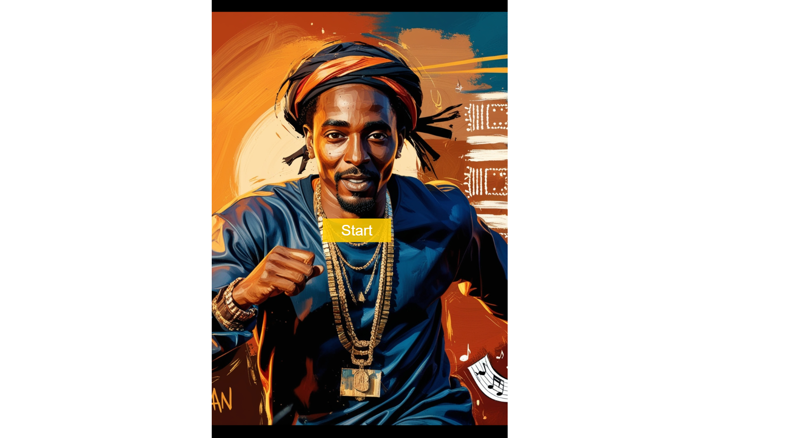
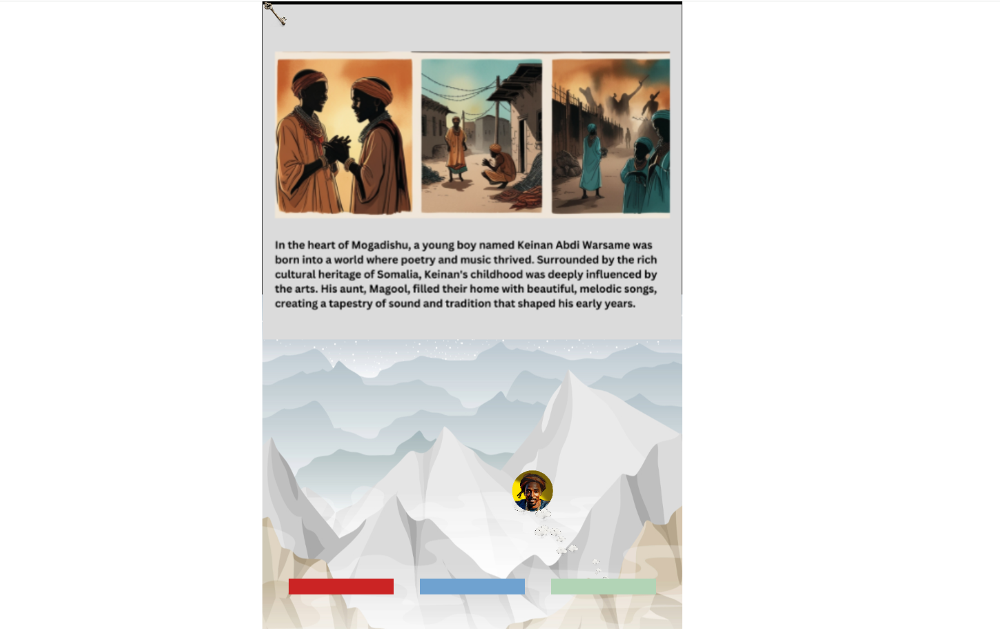
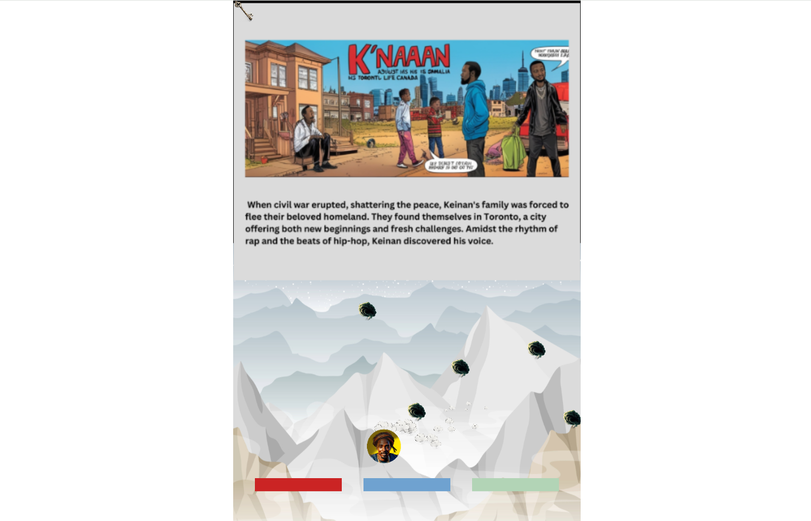
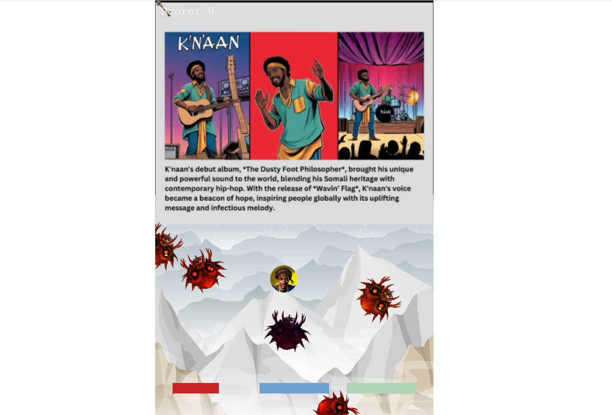

# K-naan---Interactive-Comics---Intership-Game

## Overview

Interactive-Comics: The Journey of K’naan" is an educational and immersive game that takes players through the life of K’naan, from his early days in war-torn Mogadishu to his rise as a global music icon and advocate. The game aims to foster empathy and understanding of the refugee experience through interactive storytelling and captivating visuals inspired by K’naan’s unique journey and musical style.

## Internship Project

This game is developed as part of an internship project, with the primary goal of creating an impactful and informative game using Rosebud AI and the Phaser game framework. The project merges technical skill development with creative storytelling to produce a meaningful educational tool.

## Features

- **Educational Content**: Discover the life of K’naan and the challenges faced by refugees.
- **Interactive Scenes**: Navigate different paths and pivotal moments in K’naan’s life through engaging gameplay.
- **Cultural Design**: Experience a rich atmosphere with vibrant colors and elements inspired by Somali and hip-hop culture.
- **Story-Driven Gameplay**: Unlock various scenes and events as you progress through K’naan’s journey.

## Technology Stack

- **Rosebud AI**: Used for generating assets and enhancing the creative process.
- **Phaser**: A powerful framework for developing 2D games, used to build and run the game.

## Live link:

[https://costea47.github.io/Wavin-Flags-The-Journey-of-Knaan/](https://costea47.github.io/K-naan---Interactive-Comics---Intership-Game/)

## Live on RosebudAI

[https://play.rosebud.ai/projects/12345678-1234-1234-1234-123456789abc](https://play.rosebud.ai/games/315d919c-8682-45bd-ae79-ecb744c25dc4)

## Usage

The following images show the challenge appearance and functionality:

## License

This project is licensed under the MIT License. See the [LICENSE](LICENSE) file for more details.

## Acknowledgements

- Special thanks to the Rosebud AI team for their support and resources.
- Inspired by the life and legacy of K’naan.
